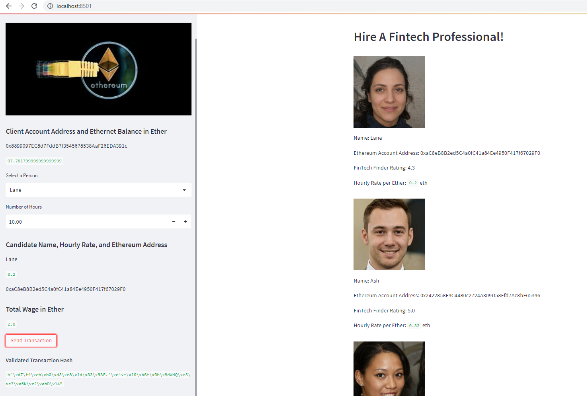
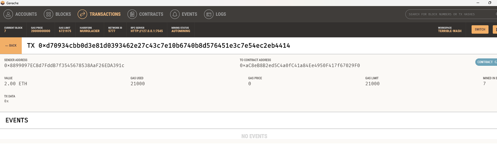

# Fintech Finder
Fintech Finder is a Python based Blockchain application. The application prototype is created for customers who can use to find fintech professionals from among a list of candidates, hire them, and pay them. Fintech Finder has an integration with the Ethereum blockchain network in order to enable its customers to instantly pay the fintech professionals whom they hire with cryptocurrency.

Assume the perspective of a Fintech Finder customer in order to do the following:

- Generate a new Ethereum account instance by using the mnemonic seed phrase provided by Ganache.
- Fetch and display the account balance associated with your Ethereum account address.
- Calculate the total value of an Ethereum transaction, including the gas estimate, that pays a Fintech Finder candidate for their work.
- Digitally sign a transaction that pays a Fintech Finder candidate, and send this transaction to the Ganache blockchain.
- Review the transaction hash code associated with the validated blockchain transaction.

---

**Required Packages:**

The program is written in Python 3.7.*. You may need the following packages to work with the program.

- [Web3.py](https://web3py.readthedocs.io/en/v5/) - Web3.py is a Python library for interacting with Ethereum.
- [Streamlit](https://streamlit.io/) - Streamlit is an open-source Python library that makes it easy to create and share beautiful, custom web apps for machine learning and data science. It turns data scripts into shareable web apps in minutes.

**Required Tool:**

Fintech Finder connects with the following private Ethereum blockchain environment to simulate the block chain transactions. Install Ganache to run your local private Ethereum blockchain environment.

* [Ganache](https://trufflesuite.com/ganache/) - Ganache is a private Ethereum blockchain environment that allows you to emulate the Ethereum blockchain so that you can interact with smart contracts in your own private blockchain.

---
## Usage

To use the Fintech Finder program, follow the key steps described as below:

- Clone the repository and load it in Visual Studio Code. Install Streamlit and other required packages to run the Python file ***fintech_finder.py*** to make sure the code is well setup.
- Launch Ganache and copy 'MNEMONIC' displayed on the top header of 'Accounts' tab. Save it in your local '.env' file.
- Open Git Bash or other Python supported terminal, type 'streamlit run fintech_finder.py' to launch the program in Streamlit Web UI. Make sure to check the path to ***fintech_finder.py*** in your terminal.

You may see Streamlit instance open in your browser shortly. Interact with Fintech Finder using the drop-down and textbox on the left sidebar.

---
## Fintech Finder Transactions Results

**Note:** Take note of 'Sender Address' and 'To Contract Address'in the Ganache window.

|Scenario: Ganache Running|
|:-:|
||

---

|Scenario: Streamlit View|
|:-:|
||

---

|Scenario: Send Transaction|
|:-:|
||

---

|Scenario: Ganache Transaction|
|:-:|
||

---

|Scenario: Ganache Blocks|
|:-:|
||

---

## Contributors

FinTech Labs, Inc.

---

## License

None